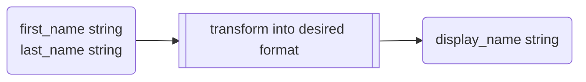

# Tutorials

This documentation section contains samples and tutorials on important topics of using the library. Look at
the [examples](https://github.com/pysnippet/fastapi-oauth2/tree/master/examples)
and [tests](https://github.com/pysnippet/fastapi-oauth2/tree/master/tests) directories of the repository for other
use-case implementations. Feel free to open an [issue](https://github.com/pysnippet/fastapi-oauth2/issues/new/choose) or
a [discussion](https://github.com/pysnippet/fastapi-oauth2/discussions/new/choose) if your question is not covered by
the documentation.

## User authentication

By following the [integration](/integration/integration) docs, for the basic authentication, you must already have
generated the client ID and secret to configure your `OAuth2Middleware` with at least one client configuration.

1. Go to the developer console or settings of your OAuth2 identity provider and generate new client credentials.
2. Provide the [client configuration](/integration/configuration#oauth2client) with the obtained client ID and secret
   into the clients of the middleware's config.
3. Set the `redirect_uri` of your application that you have also configured in the IDP.
4. Add the middleware and include the router to your application as shown in the [integration](/integration/integration)
   section.
5. Open the `/oauth2/{provider}/auth` endpoint on your browser and test the authentication flow. Check out
   the [router](/integration/integration#router) for the `{provider}` variable.

Once the authentication is successful, the user will be redirected to the `redirect_uri` and the `request.user` will
contain the user information obtained from the IDP.

## User provisioning

User provisioning refers to the process of creating, updating, and deleting user accounts within the OAuth2 IDP and
synchronizing that information with your FastAPI application's database. There are two approaches to user provisioning
and both require the user claims to be mapped properly for creating a new user or updating an existing one.

### Automatic provisioning

After successful authentication, you can automatically create a user in your application's database using the
information obtained from the IDP. The user creation or update can be handled at the `callback` function of the
[middleware](/integration/integration#oauth2middleware) as it is called when authentication succeeds.

### Manual provisioning

After successful authentication, redirect the user to a registration form where they can complete their profile. This
approach is useful when there missing mandatory attributes in `request.user` for creating a user in your application's
database. You need to define a route for provisioning and provide it as `redirect_uri`, so
the [user context](/integration/integration#user-context) will be available for usage.

::: info NOTE
In both scenarios, it is recommended to use the `identity` attribute for uniquely identifying the user from the
database. So if the application uses or plans to use multiple IDPs, make sure to include the `provider` attribute when
calculating the `identity` attribute.
:::

## Claims mapping

The `Claims` class includes permanent attributes like `display_name`, `identity`, `picture`, and `email`. It also allows
for custom attributes. Each attribute can either be a string or a callable function that takes user data and returns a
string. Suppose the user data obtained from IDP looks like follows, and you need to map the corresponding attributes for
the user provisioning and other stuff.

```json
{
  "id": 54321,
  "sub": "1234567890",
  "name": "John Doe",
  "provider": "github",
  "emails": [
    "john.doe@test.py"
  ],
  "avatar_url": "https://example.com/john.doe.png"
}
```

It looks easy for the `picture` and `display_name` attributes, but how to map `email` from `emails` or create a
unique `identity` attribute. Well, that is where the callable functions come in handy. You can use the `lambda` function
to map the attributes as follows.

```python
Claims(
    picture="image",
    display_name="avatar_url",
    email=lambda u: u.emails[0],
    identity=lambda u: f"{u.provider}:{u.sub}",
)
```

::: info NOTE

Not all IDPs provide the `first_name` and the `last_name` attributes already joined as in the example or the `email` as
a list. So you are given the flexibility using transformer function to map the attributes as you want.



:::

## CSRF protection

## PKCE support

<style>
.info {
  border: 0;
}
</style>
